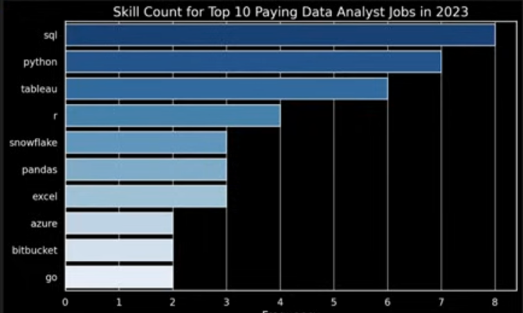

# Introduction
📊 Dive into the data job market! Focusing on data analyst roles, his project explores 💰 top-paying jobs, 🔥 in-demand skills, and 📈 where high demand meets high salary in data analytics.

🔎 SQL queries? Check them out here: [project_sql folder](/project_sql/)

# Background
Driven by a quest to navigate the data analyst job market more efficiently, this project was born from a desire to pinpoint top-paid and in-demand skills, streamlining others work to find optimal jobs.

### The questions I wanted to answer through my SQL queries were:

1. What are the top-paying analyst jobs?
2. What skills are required for these top-paying jobs?
3. What skills are most in demand for data analysts?
4. Which skills are associated with  higher salaries?
5. What are the most ptimal skills to learn?

# Tools I Used
For my deep dive into the data analyst job market, I harnessed the power of several key tools:

- **SQL:** The backbone of my analysis, allowing me to query the database and unearth critical insights.
- **PostgreSQL:** The chosen database management system, ideal for handling the job posting data.
- **Visual Studio Code:** My go-to for database management and SQL queries.
- **Git&GitHub:** Essential for version control and sharing my SQL scripts and analysis, ensuring collaboration and project tracking.

# The Analysis
Each query for this project aimed at investigating specific aspects of the data analyst job market.
Here’s how I approached each question:

### 1. Top Paying Analyst Jobs
To identify the highest-paying roles, I filterd the data analyst positions by average yearly salary and location, focusing on remote jobs. This query highlights the high paying opportunities in the field.

```SQL
SELECT
	jpf.job_id,
    cd.name AS company_name,
	jpf.job_title,
	jpf.job_location,
	jpf.salary_year_avg,
    jpf.job_schedule_type,
	jpf.job_posted_date
FROM
	job_postings_fact AS jpf
LEFT JOIN
    company_dim AS cd
    ON cd.company_id = jpf.company_id
WHERE
    jpf.job_title_short = 'Data Analyst'
    AND jpf.job_location = 'Anywhere'
    AND jpf.salary_year_avg IS NOT NULL
ORDER BY
    jpf.salary_year_avg DESC
LIMIT 10
;
```
Here’s the breakdown of the top data analyst jobs in 2023:
- **Wide Salary Range:** Top 10 paying data analyst roles span from $184,000 to $650,000, indicating significantly salary potential in the field.
- **Diverse Employers:** Companies like SmartAsset, Meta, and AT&T are among those offering high salaries, showing a broad interest across industries.
- **Job Title Variety:** There’s a high diversity in job titles, from Data Analyst to Director of Analytics, reflecting varied roles and specializations within data analytics.


*Bar graph visualizing the salary for the top 10 salaries for data analysts; ChatGPT generated this graph from my SQL query results*

# What I Learned

Throughout this adventure, I’ve turbocharged my SQL toolkit with some serious firepower:

- **🧩 Complex Query Crafting:** Mastered the art of advanced SQL, merging tables like a pro and wielding WITH clauses for ninja-level temp table maneuvers.
- **📊 Data Aggregation:** Got cozy with group by and turned aggregate functions like COUNT( ) and AVG( ) into my data-summarizing sidekicks.
- **💡 Analytical Wizardry:** Leveled up my real-world puzzle-solving skills, turning questions into actionable, insightful SQL queries.

# Conclusions
### Insights
1. **Top-Paing Data Analyst Jobs:** The highest-paying jobs for data analysts that allow remote work offer a wide range of salaries, the highest at $650,000!
2. **Skills for Top-Paying Jobs:** High-paying data analyst jobs require advanced proficiency in SQL, suggesting it’s a crucial skill for earning a top salary.
3. **Most In-Demand Skills:** SQL is also the most demanded skill in the data analyst job market, thus making it essential for job seekers.
4. **Skills with Higher Salaries:** Specialized skills, such as SVN and Solidity, are associated with the highest average salaries, indicating a premium on niche expertise.
5. **Optimal Skills for Job Market Value:** SQL leads in demand and offers for a high average salary, positioning it as one of the most optimal skills for data analysts to learn to maximize their market value.

### Closing Thoughts
This project enhanced my SQL skills and provided valuable insights into the data analyst job market. The findings from the analysis serve as a guide to prioritizing skill development and job search efforts. Aspiring data analysts can better position themselves in a competitive job market by focusing on high-demand, high-salary skills. This exploration highlights the importance of continuous learning and adaption to emerging trends in the field of data analytics.
